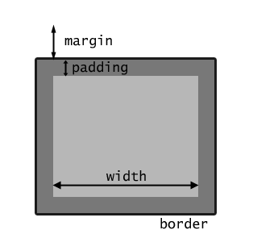

# ¿Qué es el modelo de caja?
En CSS (cascading style sheets) todos los elementos de una página web son cajas rectangulares.  
Los navegadoras acomodan estas cajas de la forma que el programador haya indicado para maquetar el sitio web.
Existen dos tipos de cajas:
* **block:** Elementos que rompen el flujo de maquetación.
* **inline:** Elementos que siguen el flujo y están contenidos dentro de elementos de bloque.  

Por ejemplo, dos párrafos serían elementos block, ya que no pueden haber dos párrafos seguidos; sino uno arriba del otro. En cambio, un enlace es un elemento inline, ya que no "corta" el texto donde está metido.  
Las propiedades más importantes de una caja son: **width**, **height**, **padding**, **border** y **margin**.

## Ancho y alto
El atributo **width** representa el ancho de la caja, pero refiriéndose al ancho interior de la caja, se puede referir a esta mediante medidas absolutas o relativas.  
Aunque los elementos inline tienen width, al modificarse con CSS no se verá ningún cambio visual. Esto es porque el ancho de estos elementos se establece automáticamente para que se ajuste a las dimensiones del elemento inline.  
Sobre el alto de la caja, se controla con la propiedad **height**, y todo lo que se dijo sobre el **width** también aplica aquí.
## Padding
Establece la distancia de "relleno" entre el límite interior de la caja y el exterior.
## Border
Establece si la caja tendrá un borde o no. También cuenta con la propiedad **width**; que sirve para establecer el grosor del borde, la propiedad **style**; que se refiere al tipo de borde a utilizar en la caja (**solid**, **dashed** o **dotted**). Por último, **color** indica el color del borde.  
## Margin
Los márgenes se controlan con la propiedad margin, y es la distancia entre el borde de la caja y los elementos que la rodean.

En cuanto a la forma de usarla, es igual que con la propiedad padding, así que la forma de escribir y los atajos es exactamente la misma.
## ¿Qué es la propiedad display?
La propiedad **display** establece si una caja se tratará como un elemento bloque o como un elemento inline y el diseño utilizado para sus hijos, como diseño de flujo, cuadrícula o flex.  
Formalmente, la propiedad **display** maneja dos tipos de visualización interna y externa para la caja. La tipo externa establece la participación de un elemento en flow layout; la tipo interna establece el layout de los hijos.